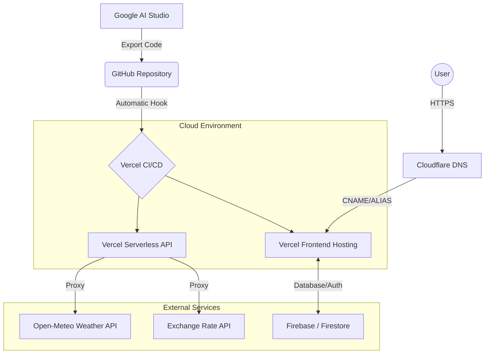

# App Architecture & Connection Workflow

This document outlines the technical stack and the deployment pipeline for the **Tokyo Travel Pal** application.

## 1. Technologies & Tools

### Core Stack
- **TypeScript**: The foundation of the entire codebase. It provides static typing to catch errors early and improve developer productivity.
- **React (v19)**: Powers the dynamic user interface. Components handle everything from the "Rate Planner" to the "Interactive Itinerary."
- **Tailwind CSS**: A modern styling tool that allows us to build a custom, polished design without writing verbose CSS files.
- **Express / Node.js**: Acts as the backend "bridge." It handles API requests for weather data and currency exchange to avoid CORS issues and secure logic.

### Integrated Services
- **Firebase**: Provides a scalable **NoSQL Database (Firestore)** to store user itineraries and **Authentication** for secure logins.
- **Vite**: The build engine that compiles the code into hyper-efficient packages for the web.

---

## 2. Global Deployment Workflow

The application follows a "GitOps" workflow, ensuring that every code change is automatically verified and deployed.

### Connection Flow
1.  **Development (Google AI Studio)**: The AI assistant generates and refines features based on user prompts.
2.  **Version Control (GitHub)**: The code is exported or pushed to a GitHub repository.
3.  **CI/CD Pipeline (Vercel)**: 
    - Vercel monitors the GitHub repository.
    - On every new push, it triggers a "Build" process.
    - It deploys the frontend files and prepares **Serverless Functions** (for the Express `/api` routes).
4.  **Backend (Firebase)**: The app communicates with Firebase for real-time data persistence.
5.  **Domain & DNS (Cloudflare)**: 
    - Cloudflare manages the DNS records for `woong.app`.
    - It points users to the Vercel deployment while providing a security and speed optimization layer.

### System Flowchart (Mermaid)

---

## 3. Key Components
- **apiRouter.ts**: The logic center for external data fetches.
- **server.ts**: The Express server configuration.
- **App.tsx**: The root of the user interface.
- **firebase-applet-config.json**: Connectivity settings for the database.
